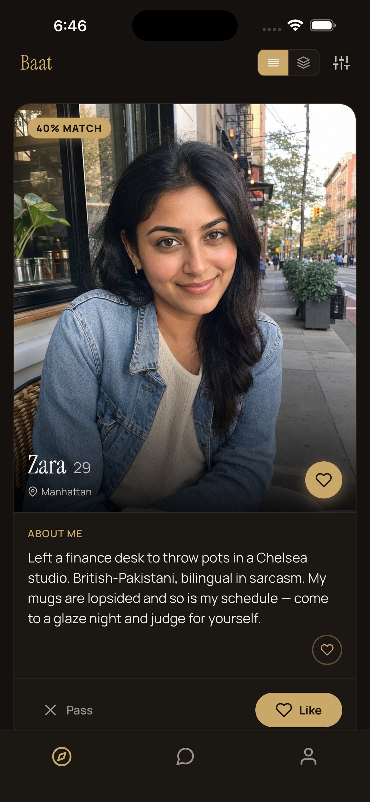
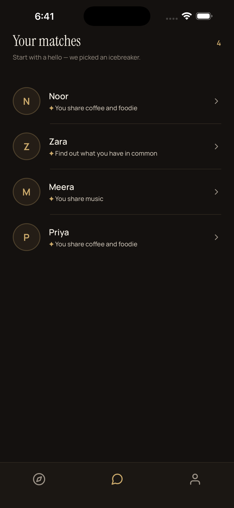
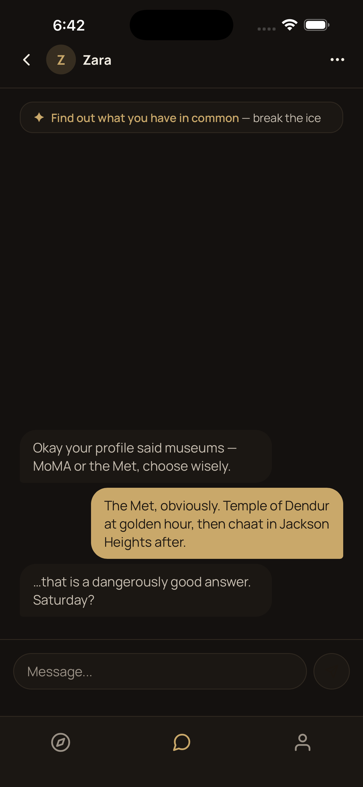
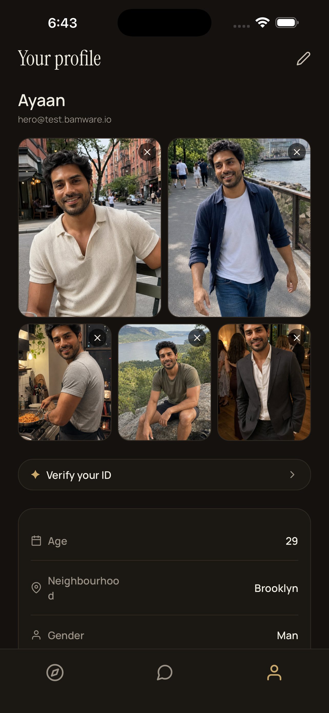
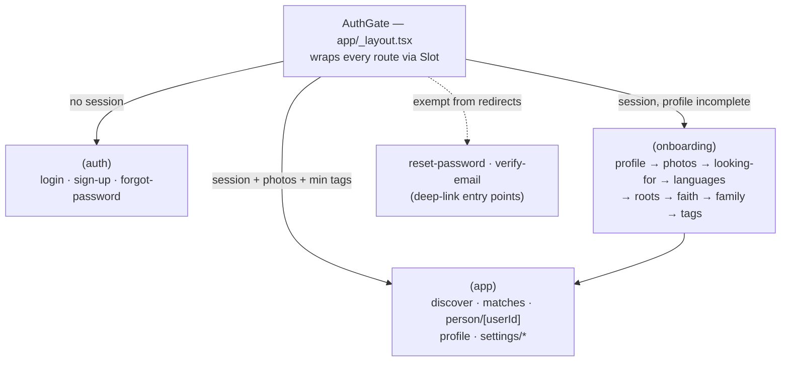

# I shipped a dating app to the App Store. Apple rejected it. Here's the code.

On 2026-07-23 I submitted Baat v1.0.6 to the App Store — full listing uploaded
via `fastlane deliver`, seeded demo account, privacy labels, the lot. On
2026-08-04 Apple rejected it under Guideline 4.3(b), the spam / saturated-category
rule. The reviewer's note, verbatim:

> "There are already enough of these apps on the App Store… reconsider the app
> concept and submit a new app."

Apple's own guideline text is just as blunt: dating apps are "well established
on the App Store and we will not accept new submissions unless they offer a
meaningfully different or improved experience." A 4.3(b) rejection is a
*concept* rejection. There is no bug to fix and no feature appeal to win — the
instruction is literally "submit a new app." I keep the full evidence base,
including what does and doesn't move App Review, in
[app-review-field-notes.md](https://github.com/mrbam88/bamware-ai/blob/main/docs/app-review-field-notes.md)
in the public brain of Bamware, the studio I run.

So the native iOS distribution track for Baat is closed. The codebase is not.
It's a complete, production-hardened React Native app — auth with native SSO
and biometrics, a white-label config layer, push deep links, in-app account
deletion, an automated release rail — and it now serves as the reference
implementation for how I build mobile apps. The release rail, upload pipeline,
and auth patterns were reused directly in BrewDesk, the app that came after.
This README is the guided tour.

## What Baat is

Baat is a Pan-South Asian dating app. The thesis: for this audience,
compatibility signals that mainstream apps bury — shared languages, faith and
practice level, expected family involvement — matter more than another photo
stack. The onboarding wizard makes them first-class: profile → photos →
looking-for → languages → roots → faith → family → tags, one screen per step
under [`app/(onboarding)/`](<app/(onboarding)>), with match scores and
common-ground chips surfaced in discovery
([`src/components/MatchBadge.tsx`](src/components/MatchBadge.tsx)).

<p align="center">
  
  
  
  
  
</p>

These are the actual App Store listing screenshots, captured by an automated
Maestro flow ([`.maestro/store-screenshots.yaml`](.maestro/store-screenshots.yaml))
— more on that rail below.

## Architecture

The app is Expo 54 / React Native 0.81 with expo-router file-based routing.
Three route groups, one gate:



`AuthGate` ([`app/_layout.tsx`](app/_layout.tsx)) routes by **profile
completeness, derived only from server-visible fields**: a user with a session
but no photos lands on the photos step; photos but too few tags resumes the
wizard; both present unlocks the tabs. That rule sounds obvious until a deep
link arrives mid-flow — `reset-password` and `verify-email` are explicitly
exempt, so a logged-out user tapping an email link isn't bounced to login
halfway through resetting their password. The wizard ordering itself is a
contract decision documented in
[`src/constants/onboarding.ts`](src/constants/onboarding.ts): tags sit last
*because* they're the server-verifiable completion marker, so relaunching the
app mid-wizard can never skip it.

**The API layer is thin on purpose.** Each file in [`src/api/`](src/api) is a
set of typed wrappers around one service area — `auth.ts`, `profile.ts`,
`discover.ts`, `matches.ts`, `photos.ts` (S3 presigned uploads), `safety.ts`,
`devices.ts` (push registration). Request/response shapes are hand-written
interfaces, each verified against the service's schema files and annotated
with the contract source (see the header of
[`src/api/safety.ts`](src/api/safety.ts)).

The one place with real machinery is
[`src/api/client.ts`](src/api/client.ts): a 401 triggers a single token
refresh while concurrent failures wait in a queue and retry with the new
token —

```ts
if (isRefreshing) {
  return new Promise((resolve) => {
    refreshQueue.push((token) => {
      originalRequest.headers.Authorization = `Bearer ${token}`
      resolve(datingClient(originalRequest))
    })
  })
}
```

— and an unrecoverable refresh calls `sessionExpired()` on the auth store,
which is the only way the app ever logs you out without asking.

**State is split by lifecycle, not by habit.** Zustand holds exactly one
store — [`src/store/authStore.ts`](src/store/authStore.ts), the session — and
TanStack Query owns everything the server owns: profiles, discovery decks,
matches. The split earns its keep at the seams: session events are imperative
(an interceptor firing `sessionExpired`, a logout wiping the query cache in
`AuthGate`), while server data wants declarative caching, `staleTime`, and
retry policy per query. A 404 on the profile fetch is a *valid state* (signed
up, no profile yet), so `getMyProfile` returns `null` instead of throwing and
the query never retries into it.

## The config layer

Every brand decision in the app resolves through one typed object:

```ts
// src/config/types.ts — abridged
interface AppConfig {
  appName: string
  tagline: string
  supportEmail: string
  legal: { termsUrl: string; privacyUrl: string }
  api: { authUrl: string; datingUrl: string }
  theme: {
    colors: {
      bg: string; surface: string; border: string
      textPrimary: string; textSecondary: string
      accent: string; accentBright: string; onAccent: string
      success: string; error: string; online: string
      // …
    }
    fonts: {
      display: string; displayItalic: string   // editorial serif for headlines
      regular: string; medium: string; bold: string  // UI sans
    }
  }
  features: {
    messaging: boolean
    photoUploads: boolean
    pushNotifications: boolean
    videoProfiles: boolean
  }
}
```

Components never import a hex code. They import `Colors` and `Fonts` from
[`src/theme/`](src/theme), which resolves from this config
([`src/theme/index.ts`](src/theme/index.ts)) — so every colour and font in the
app flows through a single file, which is how one codebase could wear multiple
brands. Baat's identity — a serif display face over a dark gold-accented
palette — shipped as a config change (PR #1, 2026-07-21), not a restyle.
Feature flags live in the same object, so a build that turns off
`videoProfiles` is a one-line diff. The type predates its current name; the
rename to `AppConfig` is ticketed rather than smuggled into a docs PR.

## Production concerns

The parts that make it a product rather than a demo:

- **Crash reporting.** Sentry initializes in
  [`app/_layout.tsx`](app/_layout.tsx) — disabled in dev, 10% trace sampling
  in prod, user context set on login and cleared on logout.
- **Push deep links.** [`src/lib/pushRouting.ts`](src/lib/pushRouting.ts) is
  pure routing logic, deliberately free of Expo imports so it's trivially
  unit-testable. It merges notification data from every place a platform may
  hide it (iOS APNS payload, Android FCM data, `content.data`), maps a tap to
  a route, and *stashes* it — the route is consumed only once the user is
  authenticated and inside the tabs, so a cold-start tap survives the login
  screen. An identifier guard turns the cold-start duplicate delivery (the
  same response arrives via the listener *and* `getLastNotificationResponseAsync`)
  into a no-op.
- **Biometric login.** [`src/lib/biometricAuth.ts`](src/lib/biometricAuth.ts)
  writes credentials to the Keychain with `requireAuthentication: true` —
  reading the item *is* the Face ID prompt, so there is no window where the
  credentials are readable un-gated. Three failed or cancelled reads wipe
  them. The enrollment offer only appears after a password login with
  remember-me on ([`src/store/authStore.ts`](src/store/authStore.ts)).
- **Secure storage with a web fallback.**
  [`src/lib/storage.ts`](src/lib/storage.ts) wraps `expo-secure-store` and
  falls back to `localStorage` on web, so the same auth code runs in a
  browser during development.
- **Account deletion, end to end.** Apple requires in-app deletion
  (Guideline 5.1.1(v)) and reviews for it. The flow in
  [`app/(app)/settings/delete-account.tsx`](<app/(app)/settings/delete-account.tsx>)
  drives `deleteAccount` in the auth store, where **order matters**: dating
  data first (profile, photos, swipes, matches, messages, device tokens),
  then the auth record — which revokes tokens, so it must go last — then the
  local session. Both service calls treat 404 as success, so a partial
  failure is safe to re-run; the half-done case surfaces as a typed
  `AccountDeletionIncompleteError` with a retry path.
- **Block and report.** [`src/api/safety.ts`](src/api/safety.ts) — blocking
  is mutual and enforced server-side (blocked pairs vanish from discovery and
  matches; message sends fail with 403), with four structured report reasons.
  Also an App Review requirement for anything with user content.
- **An audit trail.** [`src/lib/audit.ts`](src/lib/audit.ts) records auth
  events, deletions, and API errors with session/request IDs threaded through
  [`src/lib/logger.ts`](src/lib/logger.ts).

## Testing

Automated tests are the velocity driver here — they're what made overnight
agent-built PRs mergeable. Two layers:

**Jest** ([`__tests__/`](__tests__)) splits `unit/` from `integration/`. The
API wrappers are tested against `axios-mock-adapter` — including the ugly
interceptor paths: concurrent 401s draining the refresh queue, refresh
failure logging you out
([`__tests__/integration/auth-flow.test.ts`](__tests__/integration/auth-flow.test.ts)).
Pure modules get exhaustive unit coverage (`pushRouting`, `biometricAuth`,
`promptAnswers`, the auth store with and without biometrics), and a handful
of components render under test (`MatchBadge`, `PromptEditor`,
`SocialAuthButtons`).

**Maestro** ([`.maestro/`](.maestro)) covers the flows a reviewer would
actually tap through: login, logout, onboarding, discover, matches,
person-detail, profile, and — because Apple checks — account deletion
([`.maestro/delete-account.yaml`](.maestro/delete-account.yaml)). The same
harness produces the store screenshots. A nightly workflow
(`e2e-ios.yml`, kept in the private release rail) builds the app for the
simulator and runs the flows against the live dev API — the boot gate that
made unattended merges trustworthy.

Honest gaps: `integration/` holds one file; most screens have no
render-level tests (the logic they use does); Jest leaks a worker at
teardown (force-exit warning, known); and Maestro credentials come from the
environment, so the E2E suite needs a seeded account to run.

## How it shipped

The release rail is one page — [`docs/RELEASING.md`](docs/RELEASING.md) — and
three lanes: every PR runs typecheck, Jest, and a committed-secrets tripwire
([`.github/workflows/ci.yml`](.github/workflows/ci.yml)); every merge to main
publishes an over-the-air JS update to installed builds in about a minute
(`ota-update.yml`); a
`v*` tag triggers EAS cloud builds and store submission behind a GitHub
`production` environment gate
(`release.yml` — both live in the private release rail), with
fastlane lanes ([`fastlane/Fastfile`](fastlane/Fastfile)) as both the human
CLI and the local escape hatch when the EAS queue is in the way. The first
fully automated release — dispatch to TestFlight with zero laptop
involvement — was v1.0.3 on 2026-07-22. The store listing itself is code:
metadata, keywords, and screenshots live under
[`fastlane/metadata/`](fastlane/metadata) and ship via `fastlane deliver`.

A lot of the features were built by coding agents working PR fan-outs against
written specs: the first run on 2026-07-22 put three agents on three issues
in parallel and merged all three PRs the same day; the largest, overnight
into 2026-07-23, produced 13 PRs across five repos — including the account
deletion flow and push deep links described above. Every PR went through the
same CI gate as a human's. The agent-facing conventions live in
[bamware-ai](https://github.com/mrbam88/bamware-ai), the studio's shared brain.

## What I'd do differently

1. **Run the 4.3(b) preflight before writing code.** Apple's guideline names
   dating as a saturated category in plain text. I read it after the
   rejection, on 2026-08-04. Every app the studio starts now clears a
   written 4.3(b) check — differentiator visible in the binary and the
   listing — before the first commit.
2. **Land the contract layer or kill it.** `zod` sits in `package.json`
   unused; the shared client package under
   `vendor/client-core/` ended up orphaned (since retired —
   [ADR 0001](docs/adr/0001-retire-client-core.md)); and the
   onboarding wizard's cultural fields are silently stripped by the server
   to this day (the comment in
   [`src/constants/onboarding.ts`](src/constants/onboarding.ts) documents
   the workaround). Runtime validation at the API boundary would have turned
   that silent data loss into a loud test failure.
3. **Exercise token refresh against real expiry, early.** The client-side
   refresh queue was tested with mocks and looked done; in production,
   sessions still died after about 30 minutes because the server side of the
   refresh contract misbehaved. Mocked-both-sides tests can't catch a
   contract bug. One nightly E2E against real token expiry would have.
4. **Treat listing assets as day-one code, not launch-day scramble.** Icon,
   legal pages, screenshots, and privacy labels all landed on 2026-07-23 —
   submission day. The screenshot automation was worth building weeks
   earlier, when it would have caught UI regressions too.
5. **Name things for their future.** The config layer was named for its
   original narrow purpose, and renaming it now costs a repo-wide sweep plus
   this awkward paragraph. Names outlive intentions; pick the general one
   when the abstraction is born.

## Running it

```bash
yarn install
cp .env.example .env       # variable names only — see SECURITY.md for handling
yarn ios                   # or: yarn android / yarn web
yarn test                  # Jest unit + integration
maestro test .maestro/login.yaml   # needs MAESTRO_TEST_EMAIL / _PASSWORD
```

Release rail: [`docs/RELEASING.md`](docs/RELEASING.md).

## License and author

MIT. Built by **Bilal Malik** at Bamware, the studio I run in NYC —
[bamware.io](https://bamware.io) ·
[GitHub](https://github.com/mrbam88) ·
[LinkedIn](https://www.linkedin.com/in/bilal-malik-797abb35/).

The dating app didn't make it to the store. The way it was built did.
